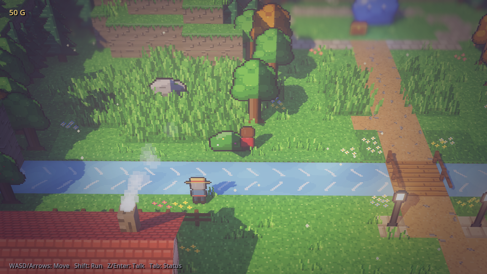
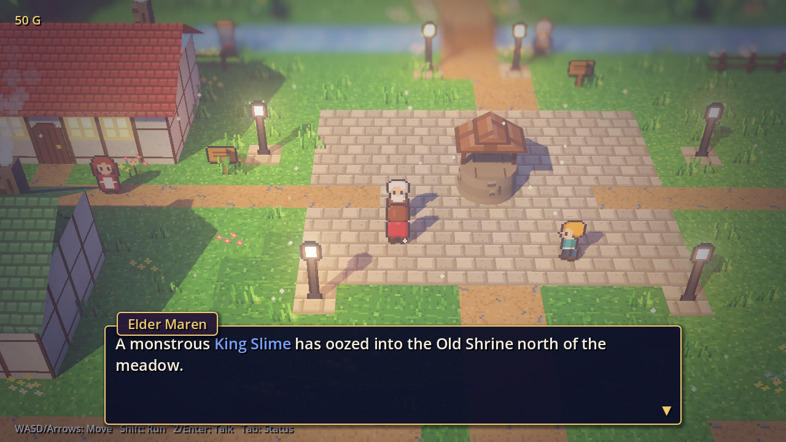
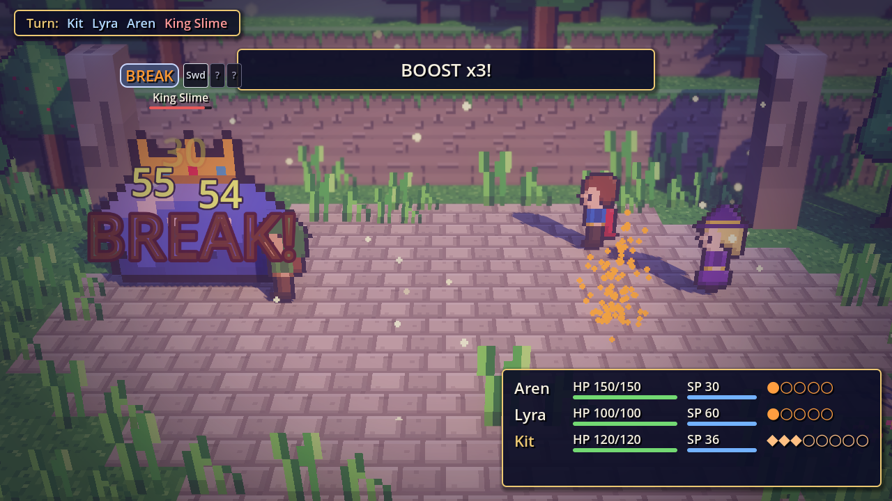

# Lumen Hollow — an HD-2D RPG in Godot 4

A small, complete RPG in the **HD-2D** style (as in *Octopath Traveler* and *Triangle Strategy*):
pixel-art sprites live in a lit, low-poly 3D diorama, with real-time shadows, bloom,
SSAO, fog and tilt-shift depth of field.

Every texture, sprite, sound effect and piece of music is **generated procedurally at
runtime** (see `scripts/view/gfx/` and `scripts/audio/`), so the repository contains no binary
art or audio assets.

| Exploration | Village | Break & Boost battle |
|---|---|---|
|  |  |  |

## Running

1. Install [Godot 4.3+](https://godotengine.org/download) (standard build; no C#/.NET needed).
2. Open `project.godot` in the editor and press **F5**, or run `godot --path .`.

The project uses the **Forward+** renderer for depth of field, SSAO and glow.

## Controls

| Action | Keyboard | Gamepad |
|---|---|---|
| Move | WASD / Arrow keys | D-pad / left stick |
| Run | Shift | X |
| Talk / Confirm | Z / Enter / Space | A |
| Cancel | X / Esc / Backspace | B |
| Status menu | Tab / C | Start |
| Boost + / − (battle) | E / Q (PageUp / PageDown) | RB / LB |

## Gameplay

- **Explore Lumen Hollow:** a village, a river with a bridge, the Whispering Meadow and the
  Old Shrine. Talk to villagers, open chests, rest at the inn and buy curatives.
- **Random encounters** happen in the tall grass. Stick to the paths to avoid them.
- **Turn-based battles** with a party of three (Aren the swordsman, Lyra the mage and Kit the hunter):
  - **Break:** every enemy has a shield. Hitting a weakness (sword, bow, staff, fire, ice,
    thunder or light) removes one point and reveals that weakness. At zero the enemy **BREAKS**:
    it loses its next turn and takes double damage.
  - **Boost:** each party member banks a Boost Point (BP) per round, up to 5. Spend up to 3 on an
    action for extra attack hits or much stronger skills.
- **Goal:** defeat the King Slime in the Old Shrine to the north. It acts twice per turn below half HP.

## Audio

Everything you hear is synthesized when the game starts, by a small chiptune synthesizer
(`scripts/audio/synth.gd`: pulse, triangle, saw, sine and noise voices with ADSR envelopes,
vibrato and pitch slides).

- **Music** (`music_library.gd`): seven original tracks written as data (chords per bar, a
  hand-written melody, and bass, arpeggio and drum patterns): title, field, battle, boss,
  plus victory, defeat and inn jingles. The loops are rendered seamless on worker threads
  the first time music is requested, so nothing hitches in play. A little reverb on the
  Music bus gives them a softer, roomier sound.
- **Sound effects** (`sfx_library.gd`): UI cursor/confirm/cancel, typewriter blips, hits,
  weakness hits, the shield break, spells (pitched per element), heals, Boost, knock-outs,
  level-ups, chests, coins, encounters and fleeing.
- **Music states**: the `Audio` autoload runs a `StateMachine` of musical situations:

  | State | Track | When it ends |
  |---|---|---|
  | `silent` | none (fades out) | — |
  | `title` | title theme, looping | — |
  | `field` | field theme, looping, **resumes where it left off** | — |
  | `battle` / `boss` | battle themes, looping | — |
  | `victory` | fanfare | hands over to `field` |
  | `inn` | lullaby (resting at the inn, waking up after a defeat) | hands over to `field` |
  | `defeat` | lament | goes `silent` |

  Gameplay code only says what is happening (`Audio.set_music(&"battle")`). The state decides
  the track, the crossfade, and what follows a jingle.

## How the HD-2D look is built

| Ingredient | Where |
|---|---|
| Tilted, narrow-FOV follow camera | `scripts/world/follow_camera.gd` |
| Near/far depth of field (tilt-shift), bloom, SSAO, fog, color grading | `scripts/gfx/visuals.gd` |
| Y-axis billboard sprites that cast shadows, with wind sway | `shaders/billboard_sway.gdshader` |
| Block terrain with textured cliff faces, timber houses, props | `scripts/world/world_builder.gd` |
| Pixel-art water with sparkles that catch the bloom | `shaders/water.gdshader` |
| Flickering lamps, glowing windows, chimney smoke, floating motes | `world_builder.gd`, `visuals.gd` |
| Procedural pixel art (characters, monsters, trees, tiles) | `scripts/gfx/sprite_factory.gd`, `texture_factory.gd` |

## Architecture

The code is split into layers. Dependencies only point downward:

| Layer | Folder | What it holds |
|---|---|---|
| Data | `scripts/data/` | Static content: skills, items, enemies, map, NPC dialogue, shop stock |
| Logic | `scripts/logic/` | Game rules. It never touches nodes, tweens, colours or the `Game` global |
| View | `scripts/view/` | Everything you see: stage, sprites, effects, HUD and world building |
| Game | `scripts/game/` | Presenters that connect logic to view, and the entities (player, NPCs, boss) |
| Core | `scripts/core/` | `StateMachine` / `State` and the input bindings |

Patterns used:

- **State machines** (`StateMachine` + `State` in `scripts/core/`):
  - **Game flow** (`game/flow/flow_states.gd`): title → explore ⇄ battle.
  - **Field modes** (`game/field/field_states.gd`): suspended / explore / interact / status.
  - **Battle turns** (`game/battle/battle_states.gd`): intro → round_start → turn_start →
    choose_action → resolve_action → round_end → outcome → victory | defeat → finished.
  - **Wandering NPCs** (`game/field/npc.gd`): wait ⇄ walk.
- **Model / View / Presenter.** In battle, `BattleModel` + `BattleRules` are the logic,
  `BattleView` is the visuals, and `Battle` is the presenter. Actions return `BattleEvent`s
  that the view replays as animations, so rules never wait on tweens and visuals never
  decide outcomes. The field works the same way: `Field`, `FieldView`, `EncounterTracker`
  and `Shop`.
- **Command.** Each battle action is an object with `execute(model)`: `AttackAction`,
  `SkillAction`, `ItemAction`, `DefendAction` and `FleeAction`.
- **Strategy.** `BattleController` decides who acts and how: `PlayerBattleInput` (menus and
  cursor), `EnemyAI`, or `AutoPartyController` (autoplay). Interactions are strategies too:
  NPCs, signs, chests and the boss each implement `Interaction.run()`.
- **Data-driven dialogue.** NPC conversations, the inn and the shop are described in
  `StoryData.NPC_DIALOGUE` rather than hard-coded.

## Project layout

```
scenes/main.tscn            Entry scene (scripts/game/flow/main.gd)
scripts/
  audio/                    Synth, MusicLibrary (score), SfxLibrary, AudioDirector ("Audio" autoload)
  core/                     StateMachine, State, input bindings
  data/                     battle_data, map_data (ASCII world), story_data (dialogue, shop)
  autoload/game.gd          Party, inventory, gold and story flags ("Game" autoload)
  logic/
    combatant.gd            Stats, Break shield, BP, levelling
    battle/                 BattleModel, BattleRules, BattleEvent, actions/, controllers/
    field/                  EncounterTracker, Shop, InteractionFinder
  view/
    battle/                 BattleView, BattleStage, BattleActorView, BattleEffects, TargetCursor, BattleUI
    world/                  FieldView, WorldBuilder, CharacterSprite, FollowCamera, lamps, talk bubble
    gfx/                    Pixel canvas, sprite and texture generators, lighting presets
    ui/                     Theme, dialogue box, menus, banners, HUD, status panel, title, transitions
  game/
    flow/                   Main + flow states
    battle/                 Battle presenter, battle states, PlayerBattleInput
    field/                  Field presenter, field states, Player, NPC, BossEntity, interactions/
shaders/                    Billboard, water, vignette and transition shaders
tests/                      Logic tests, headless smoke test, screenshot capture
```

The overworld is authored as ASCII in `scripts/data/map_data.gd`. Edit the grid to reshape
the world: rectangles of `h` become houses, `d` puts a door on the house above it, and so on
(the legend is at the top of the file). NPC lines live in `scripts/data/story_data.gd`.

## Developer flags and tests

Pass these after `--`:

```sh
godot --path . -- --skip-title            # start exploring immediately
godot --path . -- --battle                # jump into a random battle
godot --path . -- --boss --autobattle     # watch the party fight the boss on its own
godot --path . -- --at=20,8               # start on a given map cell (x, row)
godot --path . -- --skip-title --shot=out.png --shot-delay=4   # save a screenshot, then quit
```

Pure logic tests. They need no scene or renderer and finish in under a second. They cover the
damage rules, Break & Boost, the actions and 140 simulated AI-vs-AI battles:

```sh
godot --headless --path . -s tests/logic_test.gd
```

Audio test. It renders every track and sound effect, checks their levels and loop modes, and
walks the music state machine through its jingle hand-overs:

```sh
godot --headless --path . --fixed-fps 60 -s tests/audio_test.gd
```

Headless smoke test. It drives exploration, dialogue, the shop, the inn, chests, the status menu,
encounters and a boss fight through real input events:

```sh
godot --headless --path . --fixed-fps 30 -s tests/smoke_test.gd
```

`tests/capture.gd` renders showcase screenshots. It needs a GPU, or `xvfb-run` with Mesa's lavapipe.
